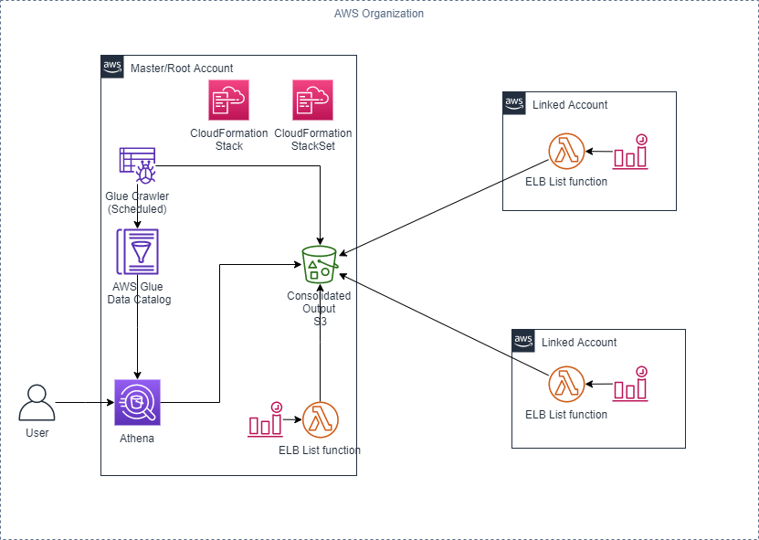

# aws-elb-report
This solution is used to consolidate AWS Classic loadbalancer(CLB) information accross all your AWS accounts and regions linked to your AWS Organization master account to a central S3. Which can then be queried using AWS Athena.

This solution uses a combination of AWS services such as S3, Lambda, Glue, Athena and cloud formation.

## Prerequisite
1. AWS accounts setup in AWS Orgnization
1. Access to deploy cloudformation stack and stackset on the AWS organization root/master account. 

## Architecture


## Deployment guide
### Deploy root Account Cloud formation
1. Clone the repo or download the cloudformation templates locally.
1. Log on to the AWS organisation root account and region of choice eg. ap-southeast-2.
1. Goto cloudformation-> Stacks -> Create stack -> With new resources(standard)
1. In the Create Stack -> Template is ready -> upload a template file -> Choose file -> Choose the path to the `root-cf.yaml` from the repo. 
1. Specify the stack parameters,

| Parameter          | Value              | Description                                                                                                                                                         |   |   |
|--------------------|--------------------|---------------------------------------------------------------------------------------------------------------------------------------------------------------------|---|---|
| Stack name         | elb-report         | name of the CF stack                                                                                                                                                |   |   |
| YourOrganisationId | o-yyyyyyyyyy       | Refer the document to get the Organisation ID    https://docs.aws.amazon.com/organizations/latest/userguide/orgs_manage_org_details.html                            |   |   |
| S3KeyPrefix        | elb                | Prefix to be added to the S3 bucket where the output files will be put                                                                                              |   |   |
| ELBLambdaCron      | cron(0 18 * * ? *) | default value run the Lambada function every day at UTC 18:00                                                                                                       |   |   |
| ELBGlueCrawlerCron | cron(0 20 * * ? *) | default value run the Lambada function every day at UTC 20:00. If you   change the deafult value ensure this is scheduled atleast 2 hours after   Lambda execution. |   |   |
6. click next, next, check "I acknowledge that AWS CloudFormation might create IAM resources." and Create stack
7. on succesfull deployment of the stack, note down the cloudformation output `ConsolidatedOutputS3`. this will be used in the next stackset deployment.

Note:
- Once the stack is deployed the is `ELBListLambda` lambda gets triggered as per the `ELBLambdaCron` parameter. 
- The `ElbGlueCrawler` Glue Crawler gets triggered as per the `ELBGlueCrawlerCron` parameter. However, thia should run 2 hours after the `ELBLambdaCron`to ensure any Partition changes are picked and added to the Glue table.  

### Deploy stackset
1. Log on to the AWS organisation root account and region of choice eg. ap-southeast-2.
1. Goto cloudformation-> Stacks -> Create StackSet
1. Choose a templete -> Template is ready -> Upload a template file -> Choose file -> Choose the path to the `elb-stackset-cf.yaml` form the repo.
1. stackset parameters,

| Parameter            | Value                           | Description                                                                                                                         |   |   |
|----------------------|---------------------------------|-------------------------------------------------------------------------------------------------------------------------------------|---|---|
| Stack name           | elb-report                      | name of the CF stack                                                                                                                |   |   |
| ConsolidatedOutputS3 | elb-report-consolidatedoutputs3 | Central S3 bucket to send all the outputs of the linked accounts Lambda script. Refer the root-cf.yml output 'ConsolidatedOutputS3' |   |   |
| S3KeyPrefix          | elb                             | Prefix to be added to the S3 bucket where the output files will be put.   Same as the one used in the root cf.                      |   |   |
| ELBLambdaCron        | e.g cron(0 18 * * ? *)          | default value run the Lambada function every day at UTC 18:00. Same as   the one used in root CF                                    |   |   |
5. click next
1. Selct "Service managed permissions"
1. Under Deployment targets, select `Deploy to organization`, Automatic deployment `Enabled`, Account removal behavior `Delete stacks`
1. under Region, selct the same region where the consolidated S3 bucket is.
1. under Deployment Options, select defaults or change accodingly.
1. click next
1. check "I acknowledge that AWS CloudFormation might create IAM resources." and Submit

Note:
- Once the stackset is completed it deploys the stacks across all the linked accounts deployed the is `ELBListLambda` lambda gets triggered as per the `ELBLambdaCron` parameter. Keep it same as the `root-cf` stack deployment

## Usage
### Using Athena

You can run the below Athena query on your master account in the same region as the root Account Cloud formation was deployed. 

```
# Display top 10 
SELECT * FROM "<DB name>"."<Tablename>" limit 10;
```

```
# Display ELBs with 0 backend 
SELECT * FROM "<DB name>"."<Tablename>"
WHERE backendinstancecount = 0;
```